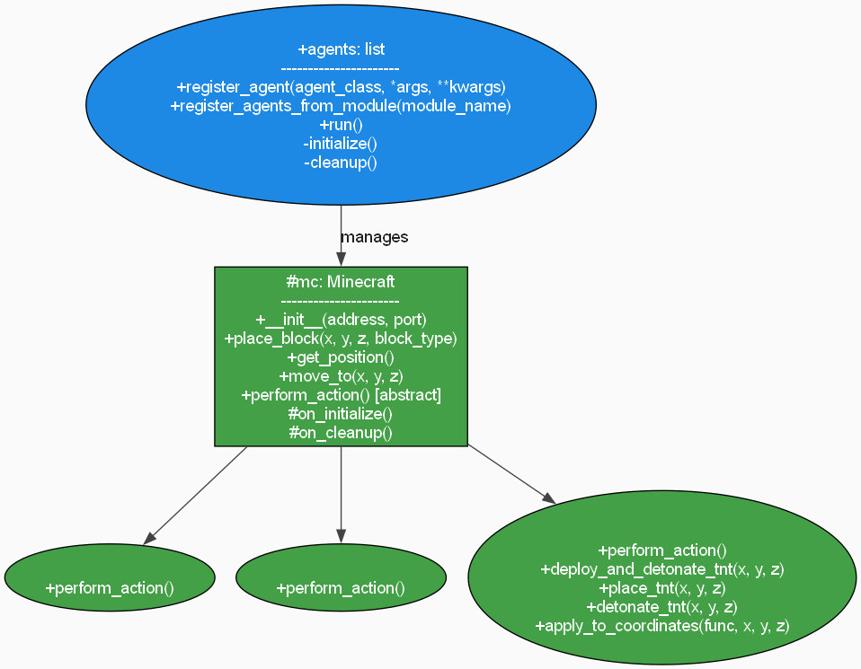
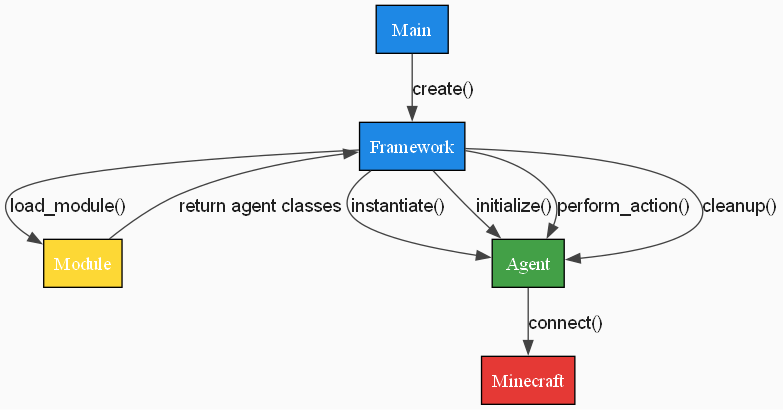
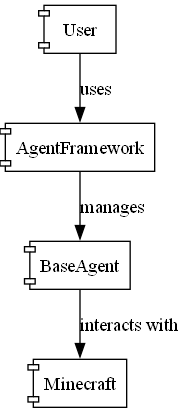

[](https://codecov.io/gh/mbelsfar2/tapMinecraft)

# Documentación de Agent Framework

## Introducción

Este Agent Framework permite a los usuarios crear y gestionar agentes que interactúan con un servidor de Minecraft. Proporciona una clase base para los agentes y un mecanismo para registrarlos y ejecutarlos.

## Creación de un Agente

Para crear un nuevo agente, sigue estos pasos:

1. **Crear una subclase de `BaseAgent`:**  
   Define una nueva clase que herede de `BaseAgent` e implementa el método `perform_action`.

   ```python
   from agentFramework import BaseAgent

   class MiAgente(BaseAgent):
       def __init__(self, address="localhost", port=4711):
           super().__init__(address, port)
           # Inicializa cualquier atributo adicional aquí

       def perform_action(self):
           # Define las acciones que realizará tu agente
           pos = self.get_position()
           self.place_block(pos.x + 1, pos.y, pos.z, 1)  # Acción de ejemplo
   ```

2. **Registrar el agente en el Agent Framework:**  
   Crea una instancia de `AgentFramework`, registra tu agente y ejecuta el Agent Framework.

   ```python
   from agentFramework import AgentFramework
   from miAgente import MiAgente

   framework = AgentFramework()
   framework.register_agent(MiAgente, "localhost", 4711)
   framework.run()
   ```

## Contrato de la API de Agentes

### Clase `BaseAgent`

- **`__init__(self, address="localhost", port=4711)`**  
  - Se conecta al servidor de Minecraft en la dirección y puerto especificados.  
  - **Parámetros:**  
    - `address` (str): La dirección del servidor de Minecraft.  
    - `port` (int): El puerto del servidor de Minecraft.  

- **`place_block(self, x, y, z, block_type)`**  
  - Coloca un bloque en las coordenadas especificadas.  
  - **Parámetros:**  
    - `x` (int): Coordenada x.  
    - `y` (int): Coordenada y.  
    - `z` (int): Coordenada z.  
    - `block_type` (int): Tipo de bloque a colocar.  

- **`get_position(self)`**  
  - Devuelve la posición actual del jugador.  
  - **Retorna:**  
    - `mcpi.vec3.Vec3`: La posición del jugador.  

- **`move_to(self, x, y, z)`**  
  - Mueve al jugador a las coordenadas especificadas.  
  - **Parámetros:**  
    - `x` (int): Coordenada x.  
    - `y` (int): Coordenada y.  
    - `z` (int): Coordenada z.  

- **`perform_action(self)`**  
  - Este método debe ser implementado por todas las subclases. Define las acciones que realizará el agente.  
  - **Lanza:**  
    - `NotImplementedError`: Si la subclase no implementa este método.  

### Clase `AgentFramework`

- **`__init__(self)`**  
  - Inicializa una lista vacía para almacenar los agentes registrados.  

- **`register_agent(self, agent_class, *args, **kwargs)`**  
  - Crea una instancia de la clase del agente y la añade a la lista de agentes.  
  - **Parámetros:**  
    - `agent_class` (class): La clase del agente a registrar.  
    - `*args`: Argumentos posicionales para pasar al constructor del agente.  
    - `**kwargs`: Argumentos con nombre para pasar al constructor del agente.  

- **`run(self)`**  
  - Ejecuta continuamente el método `perform_action` de cada agente registrado.  
  - **Nota:** Ajusta el intervalo de espera según sea necesario.

## UML Diagrams

### Class Diagram



### Sequence Diagram



### Component Diagram

